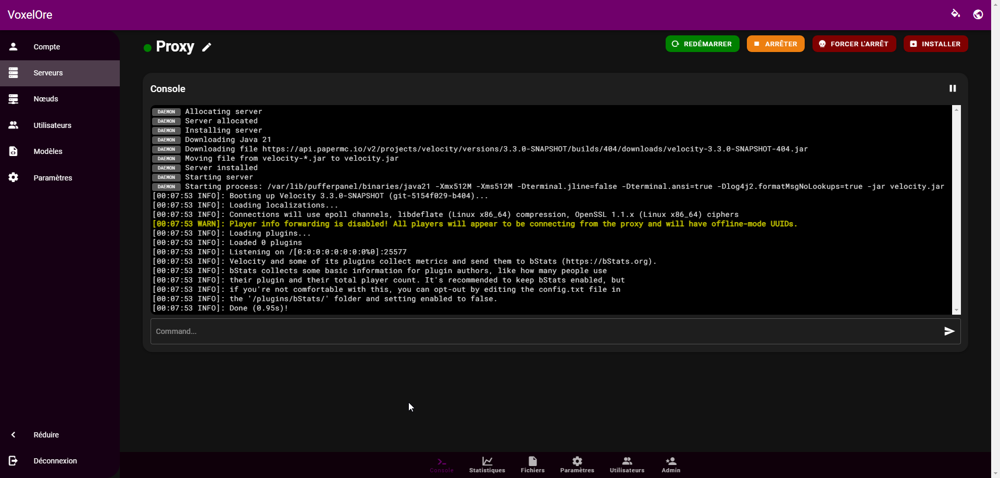

# PufferPanel Themes
This README provides instructions on how to use themes with PufferPanel.

## Installation

1. Download the desired theme from the PufferPanel theme repository [here](https://github.com/light2k4/pufferpanel-themes/releases/latest).
2. Navigate to the `/var/www/pufferpanel/theme` directory in your PufferPanel installation.
3. Put the .tar archive in the `/var/www/pufferpanel/theme` directory.

## Activation

1. Go to the PufferPanel admin panel.
2. Click on the `Settings` tab.
3. On `Default Theme`, select the desired theme.
4. Click on the `Save` button.

If you don't see the theme in the list, reload the page with `Ctrl + F5`. (This clears the cache)


## Preview


```markdown

```


## Troubleshooting

If you have any issues with the theme, please open an issue on the theme repository [here](https://github.com/light2k4/pufferpanel-themes/issues) or join the [Discord server](https://discord.gg/YmA88jc7GF).

## Contributing

If you want to contribute to the themes, please open a pull request on the theme repository [here](https:///github.com/light2k4/pufferpanel-themes/pulls).

## License

This project is licensed under the MIT License - see the [LICENSE](https://github.com/light2k4/pufferpanel-themes/blob/main/LICENSE) file for details.

## Credits

- [PufferPanel](https://pufferpanel.com)
- [Light](https://github.com/light2k4)

```